# Herzog Incident Investigation & Corrective Action System
# User Manual v1.0

---

## Table of Contents

1. [Getting Started](#1-getting-started)
2. [Dashboard](#2-dashboard)
3. [Incidents](#3-incidents)
4. [Investigations](#4-investigations)
5. [Corrective & Preventive Actions (CAPA)](#5-corrective--preventive-actions-capa)
6. [Recurrence Detection](#6-recurrence-detection)
7. [Trend Analysis](#7-trend-analysis)
8. [OSHA Reports](#8-osha-reports)
9. [Administration](#9-administration)
10. [User Roles & Permissions](#10-user-roles--permissions)
11. [Offline Mode](#11-offline-mode)

---

## 1. Getting Started

### Logging In

The system uses Azure Active Directory (Azure AD) for single sign-on. When you navigate to the application, you will be automatically authenticated through your organization's Azure AD account.

In development mode, a **Dev User Switcher** appears in the top bar allowing you to switch between different user roles for testing purposes.

### Navigation

The application uses a left sidebar for navigation. The sidebar shows only the sections your role has access to. You can collapse the sidebar by clicking the chevron icon at the top.

On mobile devices, the sidebar is hidden by default and can be opened using the hamburger menu icon in the top bar.

### Top Bar

The top bar contains:
- **Dev User Switcher** (development only) -- switch between user roles
- **Sync Status** -- shows pending offline changes (if any)
- **Notifications** -- bell icon for system notifications
- **User Profile** -- your name and role displayed on the right

---

## 2. Dashboard

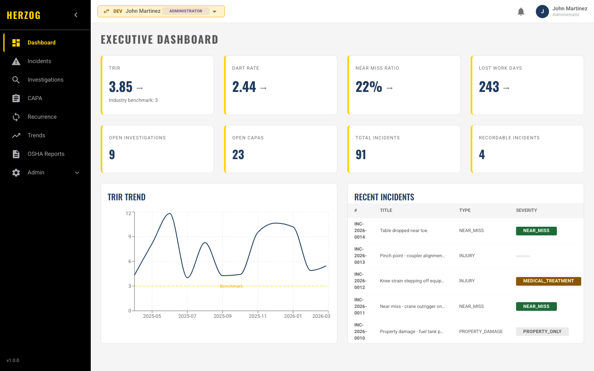

The Executive Dashboard is the landing page and provides a high-level overview of safety performance across the organization.

### KPI Cards (Top Row)

Four primary KPI cards are displayed across the top:

- **TRIR** (Total Recordable Incident Rate) -- calculated as (Recordable Incidents x 200,000) / Total Hours Worked. The industry benchmark is shown below the value for comparison.
- **DART Rate** (Days Away, Restricted, or Transferred) -- similar formula using DART-qualifying incidents.
- **Near Miss Ratio** -- percentage of total incidents that are near misses. Higher is better as it indicates proactive reporting.
- **Lost Work Days** -- total days away from work due to injuries.

### Stats Row (Second Row)

Four additional metric cards show:
- **Open Investigations** -- investigations not yet complete
- **Open CAPAs** -- corrective/preventive actions still in progress
- **Total Incidents** -- year-to-date incident count
- **Recordable Incidents** -- OSHA-recordable incidents

### TRIR Trend Chart

A line chart showing the TRIR over the past 12 months. A dashed benchmark line shows the industry average for comparison.

### Recent Incidents Table

The 10 most recent incidents with their number, title, type, severity, status, and date. Click any row to navigate to the incident detail page.

### Division Dashboard

Navigate to a division-specific dashboard by selecting a division from the sidebar or URL. The division dashboard shows the same metrics scoped to that division, with a company average comparison.

---

## 3. Incidents

### Incident List

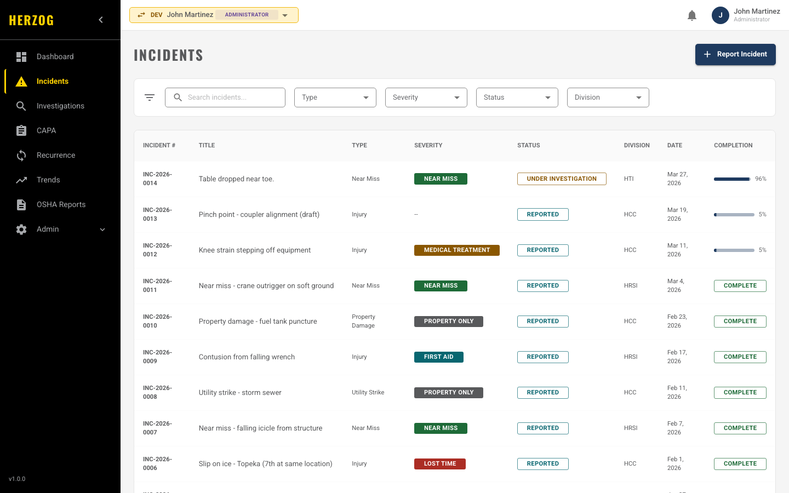

The Incidents page shows all reported incidents in a filterable, paginated table.

**Filters:**
- **Type** -- Injury, Near Miss, Property Damage, Environmental, Vehicle, Fire, Utility Strike
- **Severity** -- First Aid, Medical Treatment, Restricted Duty, Lost Time, Fatality, Near Miss, Property Only
- **Status** -- Reported, Under Investigation, Investigation Complete, CAPA Assigned, CAPA In Progress, Closed, Reopened
- **Division** -- HCC, HRSI, HSI, HTI, HTSI, Herzog Energy, Green Group
- **Search** -- free text search across incident number and title

**Table Columns:**
- Incident # (e.g., INC-2025-0042)
- Title
- Type
- Severity (color-coded chip)
- Status (color-coded chip)
- Division
- Date
- Completion % (progress bar shown for draft incidents)

Click any row to view the incident detail. Click **Report Incident** (top right) to create a new incident.

### Reporting a New Incident

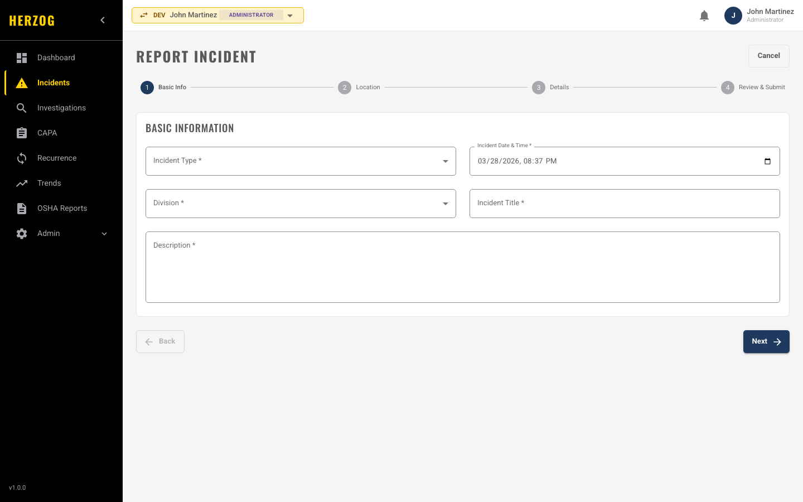

The incident report form uses a multi-step wizard:

**Step 1: Basic Information**
- Incident Type (required)
- Date and Time (required)
- Division (required)
- Title
- Description (required)

**Step 2: Location**
- Job Site
- Location Description
- GPS Coordinates (can auto-detect using the location button)

**Step 3: Details**
- Severity
- Shift (Day/Night/Swing)
- Weather Conditions
- Immediate Actions Taken

**Step 4: Review & Submit**
- Review all entered information
- Submit creates the incident as a draft

New incidents are created as **drafts** with a completion percentage based on how many fields are filled in. A Safety Coordinator can later complete the remaining details.

### Incident Detail

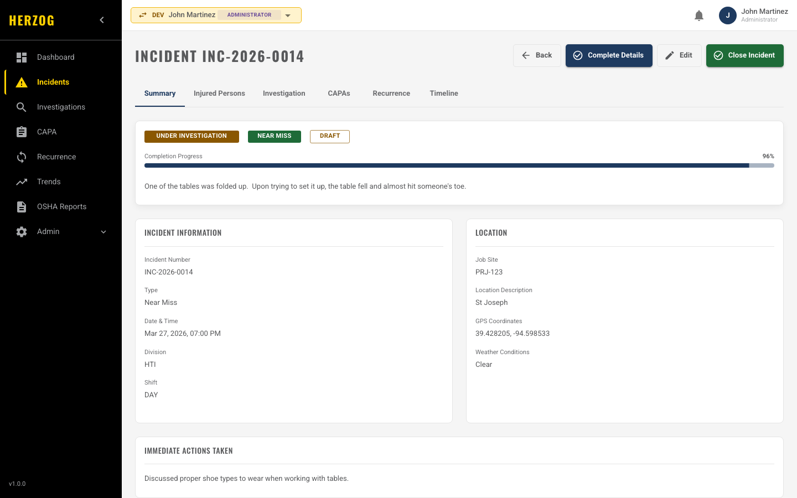

The incident detail page has six tabs:

**Summary Tab:**
- Status badge, severity indicator, and draft completion progress bar
- Incident information (number, type, date, time, division)
- Location details
- Immediate actions taken
- Action buttons: Back, Complete Details (if draft), Edit, Begin Investigation

**Injured Persons Tab:**
- Table of injured persons associated with this incident
- Shows employee name, job title, injury type, body part, treatment type

**Investigation Tab:**
- Shows linked investigation if one exists, with status and lead investigator
- "Start Investigation" button if no investigation exists yet
- Clicking "Start Investigation" creates the investigation and navigates to it

**CAPAs Tab:**
- Table of corrective/preventive actions linked to this incident
- Shows CAPA number, title, priority, status, assigned to, due date

**Recurrence Tab:**
- Shows any incidents linked through recurrence detection
- Displays similarity type (Same Location, Same Type, Same Root Cause, etc.)

**Timeline Tab:**
- Chronological audit log of all changes made to this incident
- Shows who made each change and when

### Completing Incident Details

For draft incidents, click **Complete Details** to fill in the remaining fields. A progress bar at the top shows current completion percentage. Fields that are still missing are highlighted. The form auto-saves as you fill in fields.

### Editing an Incident

Click **Edit Incident** to open the full edit form. This allows modification of all incident fields organized in sections: Basic Info, Location, Details, and OSHA/Client Info.

---

## 4. Investigations

### Investigation List

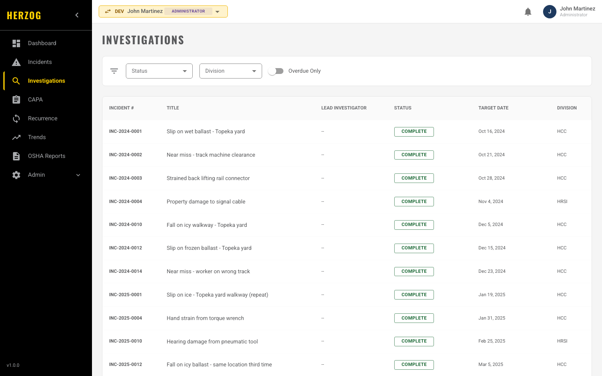

The Investigations page lists all investigations with filters:

- **Status** -- Not Started, In Progress, Pending Review, Complete
- **Division** -- filter by the incident's division
- **Overdue** -- toggle to show only overdue investigations

**Table Columns:**
- Incident # (from linked incident)
- Title
- Lead Investigator
- Status (color-coded chip)
- Target Date (highlighted red if overdue)
- Division

### Starting an Investigation

Investigations are created from the incident detail page. Navigate to an incident, click the **Investigation** tab, then click **Start Investigation**. This:
1. Creates a new investigation linked to the incident
2. Sets the target completion date based on severity:
   - Fatality: 30 business days
   - Lost Time: 5 business days
   - Restricted Duty / Medical Treatment: 10 business days
   - First Aid / Near Miss / Property Only: 14 business days
3. Transitions the incident status to "Under Investigation"
4. Navigates you to the new investigation

### Investigation Detail

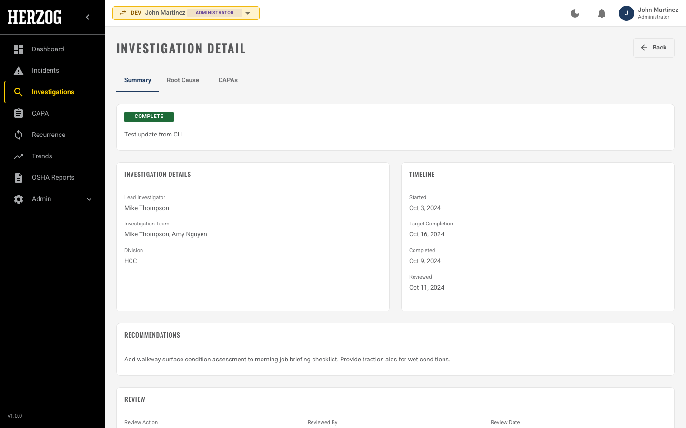

The investigation detail page shows:

**Summary Tab:**
- Lead Investigator, Investigation Team, Division
- Started Date, Target Completion Date, Completed Date
- Investigation Summary
- Root Cause Method and Summary
- Recommendations
- Review information (if reviewed)

**Root Cause Tab:**
- Links to the Root Cause Analysis page

**CAPAs Tab:**
- Lists corrective/preventive actions assigned from this investigation

**Action Buttons:**
- **Edit** -- opens a dialog to edit Lead Investigator, Investigation Team, Investigation Summary, Root Cause Method/Summary, and Recommendations
- **Submit for Review** -- transitions status to Pending Review
- **Complete Review** -- (for Safety Managers) approve or return the investigation

### Root Cause Analysis

The Root Cause Analysis page provides two analysis methods:

**5-Why Analysis Tab:**
- A stepped questioning approach to drill down to root causes
- Each level shows a Question, Answer, and Evidence field
- Click "Add Why" to add a new level (minimum 3, maximum 7)
- Each entry can be deleted individually

**Fishbone (Ishikawa) Tab:**
- Six category cards: People, Process, Equipment, Materials, Environment, Management
- Each category shows its contributing factors
- Factors highlighted in gold are marked as "Contributing"
- Click "Add Factor" on any category to add a new factor
- Toggle between diagram view and accessible table view using the toggle in the top right

### Investigation Review Workflow

1. Investigator completes the investigation and clicks **Submit for Review**
2. Status changes to "Pending Review"
3. Safety Manager reviews and clicks **Complete Review**
4. In the review dialog, choose **Approve** or **Return** with comments
5. Approved investigations are marked Complete; returned investigations go back to In Progress

---

## 5. Corrective & Preventive Actions (CAPA)

### CAPA List

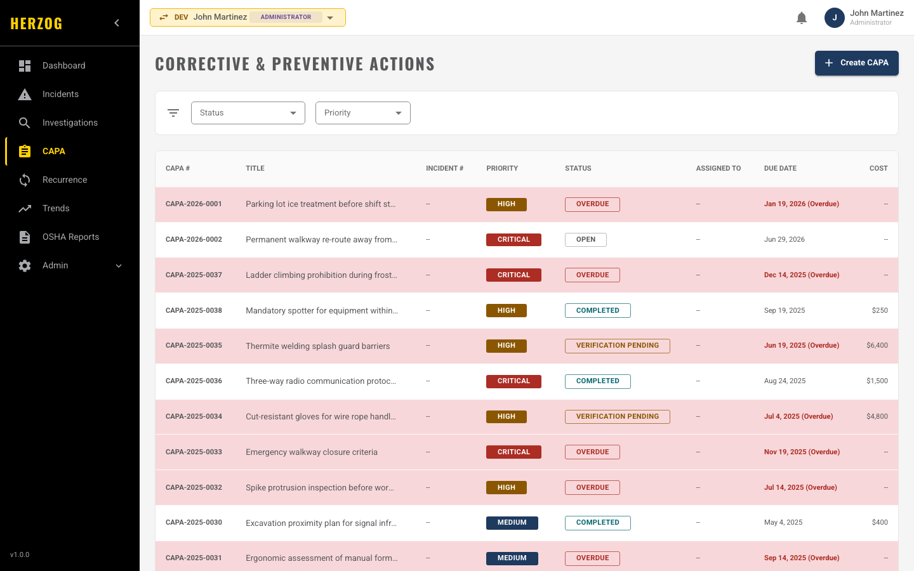

The CAPA page lists all corrective and preventive actions with filters:

- **Status** -- Open, In Progress, Completed, Verification Pending, Verified Effective, Verified Ineffective, Overdue
- **Priority** -- Critical, High, Medium, Low

**Table Columns:**
- CAPA # (e.g., CAPA-2025-0012)
- Title
- Incident # (linked incident)
- Priority (color-coded chip)
- Status (color-coded chip)
- Assigned To
- Due Date (red if overdue)
- Cost

Rows with overdue CAPAs are highlighted with a red background.

### Creating a CAPA

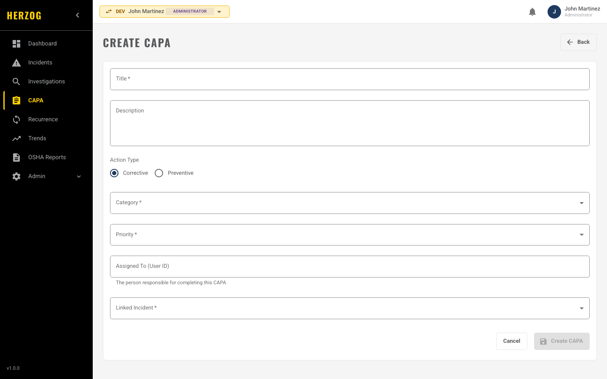

Click **Create CAPA** to open the creation form:

- **Title** (required)
- **Description**
- **Action Type** -- Corrective or Preventive (radio buttons)
- **Category** -- Training, Procedure Change, Engineering Control, PPE, Equipment Modification, Disciplinary, Policy Change, Other
- **Priority** -- Critical (7 days), High (14 days), Medium (30 days), Low (60 days). Selecting a priority automatically calculates and displays the due date.
- **Assigned To** -- user dropdown
- **Linked Incident** -- select the related incident

### CAPA Lifecycle

CAPAs follow a defined lifecycle:

1. **Open** -- newly created, awaiting action
2. **In Progress** -- work has started (click "Start" on the detail page)
3. **Completed** -- action is done (click "Complete", provide completion notes and evidence)
4. **Verification Pending** -- awaiting effectiveness verification (30-day window)
5. **Verified Effective** or **Verified Ineffective** -- final determination

If a CAPA passes its due date while still Open or In Progress, it is automatically marked **Overdue** by the system's escalation engine.

### CAPA Detail

The CAPA detail page shows:
- **Status Tracker** -- horizontal stepper showing the CAPA lifecycle with the current step highlighted
- **Detail Card** -- all CAPA fields (title, description, type, category, priority, dates, cost)
- **Action Buttons:**
  - **Start** (if Open) -- begins work on the CAPA
  - **Complete** (if In Progress) -- opens a dialog for completion notes and evidence
  - **Verify** (if Verification Pending) -- opens a dialog to mark as Effective, Partially Effective, or Ineffective with notes

### Overdue Escalation

The system automatically checks for overdue CAPAs and investigations every 30 minutes:
- **+3 days overdue** -- Safety Manager notified
- **+7 days overdue** -- Division Manager notified
- **+14 days overdue** -- Executive notified

---

## 6. Recurrence Detection

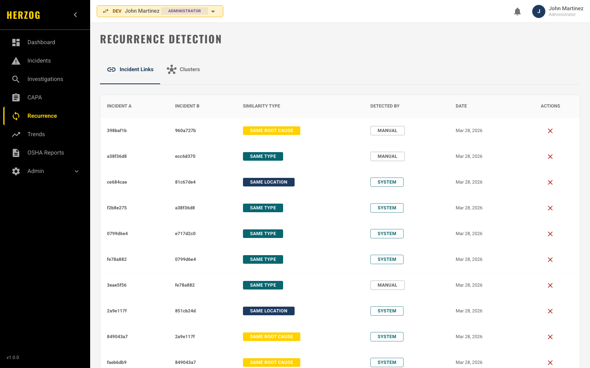

The Recurrence Detection page identifies patterns of similar incidents.

### Incident Links Tab

Shows all detected recurrence links between incidents:
- **Incident Pair** -- the two linked incidents (clickable to navigate)
- **Similarity Type** -- color-coded chip showing the match type:
  - Same Location -- incidents at the same job site within 12 months
  - Same Type -- same incident type at the same location within 12 months
  - Same Root Cause -- same primary contributing factor within 24 months
  - Same Person -- same injured employee (all time)
  - Same Equipment -- same equipment involved within 12 months
- **Detected By** -- System (automatic) or Manual
- **Dismiss** -- button to dismiss a false-positive link

### Clusters Tab

Groups recurrence links by similarity type to show patterns:
- Cards display the count of links per pattern type
- Click any card to switch to the Incident Links tab filtered by that type
- A blue banner shows the active filter with a "Show All" button

### Automatic Detection

Recurrence detection runs automatically when a new incident is created. The system checks:
1. Same job site + same incident type (within 12 months)
2. Same primary contributing factor (within 24 months)
3. Same injured person by employee ID (all time)
4. Same equipment (within 12 months)

### Manual Linking

Safety Coordinators can manually link incidents that the automatic system may have missed using the manual link feature.

---

## 7. Trend Analysis

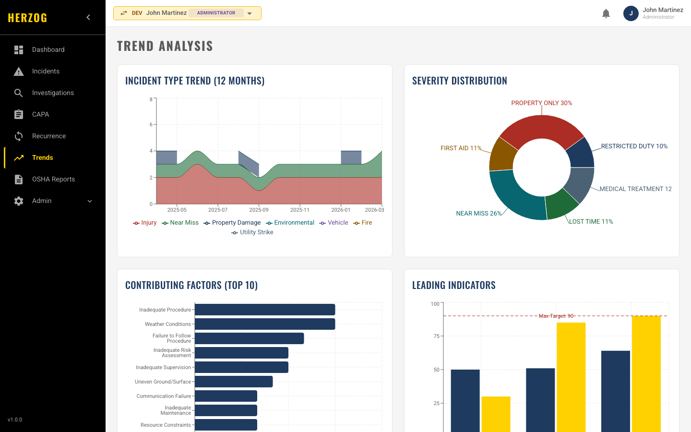

The Trend Analysis page provides four analytical views:

### Incident Type Trend (12 Months)
A stacked area chart showing the monthly count of incidents by type (Injury, Near Miss, Property Damage, Environmental, Vehicle, Fire, Utility Strike). Helps identify seasonal patterns or increasing trends.

### Severity Distribution
A donut chart showing the breakdown of all incidents by severity level. Useful for understanding the overall risk profile.

### Contributing Factors (Top 10)
A horizontal bar chart ranking the most frequently cited contributing factors. Highlights systemic issues that need organizational attention.

### Leading Indicators
A grouped bar chart showing actual vs. target values for:
- **Near Miss Rate** -- percentage of incidents that are near misses (target: 30%)
- **CAPA Closure Rate** -- percentage of CAPAs that are completed/verified (target: 85%)
- **Investigation Timeliness** -- percentage of investigations completed on time (target: 90%)

---

## 8. OSHA Reports

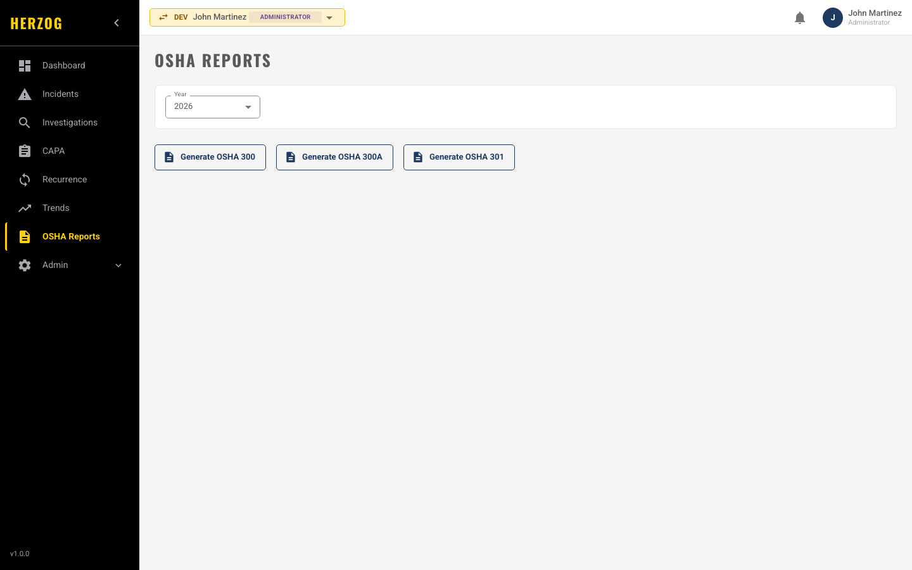

The OSHA Reports page generates the required OSHA recordkeeping forms.

### Generating Reports

1. Select a **Year** from the dropdown
2. Click one of three buttons:

**OSHA 300 -- Log of Work-Related Injuries**
- Lists all OSHA-recordable incidents for the selected year
- Columns: Case #, Employee, Job Title, Date, Location, Description, Death, Days Away, Days Restricted, Injury Type, Body Part

**OSHA 300A -- Summary of Work-Related Injuries**
- Annual summary with totals:
  - Total cases, total deaths
  - Cases with days away, restriction, or transfer
  - Total days away and restricted
  - Total hours worked

**OSHA 301 -- Injury and Illness Incident Report**
- Individual incident reports for all recordable incidents in the year
- Includes employee info, incident details, injury description, treatment

### Printing

Click the **Print** button to open the browser's print dialog. The print stylesheet formats the report for clean paper output, hiding navigation and interactive elements.

---

## 9. Administration

The Administration section is only accessible to users with the Administrator role. It contains seven sub-sections accessible from the sidebar:

### User Management

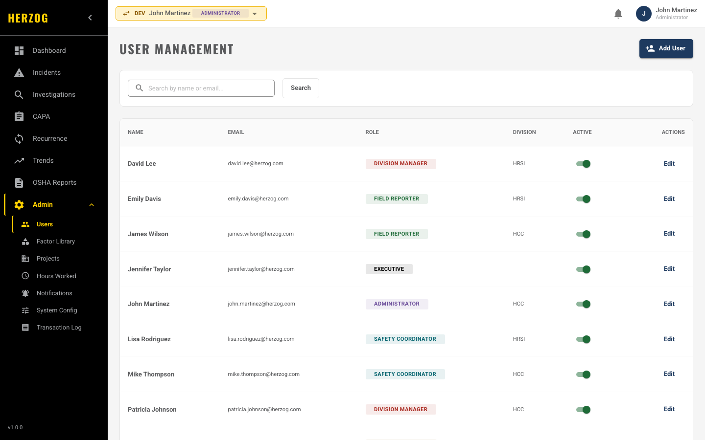

Manage system users:
- **Add User** -- create new users with name, email, role, and division
- **Edit** -- change a user's role or division
- **Active Toggle** -- deactivate/reactivate users (soft delete)
- **Search** -- filter by name or email

### Factor Library

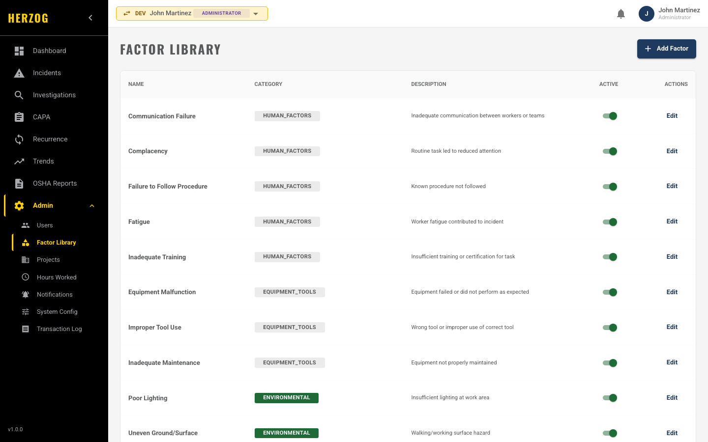

Manage the library of contributing factor types used in investigations:
- **Categories**: Human Factors, Equipment/Tools, Environmental, Procedural, Management/Organizational
- Add, edit, or deactivate factor types
- Deactivated factors are hidden from selection but preserved in historical data

### Project Management

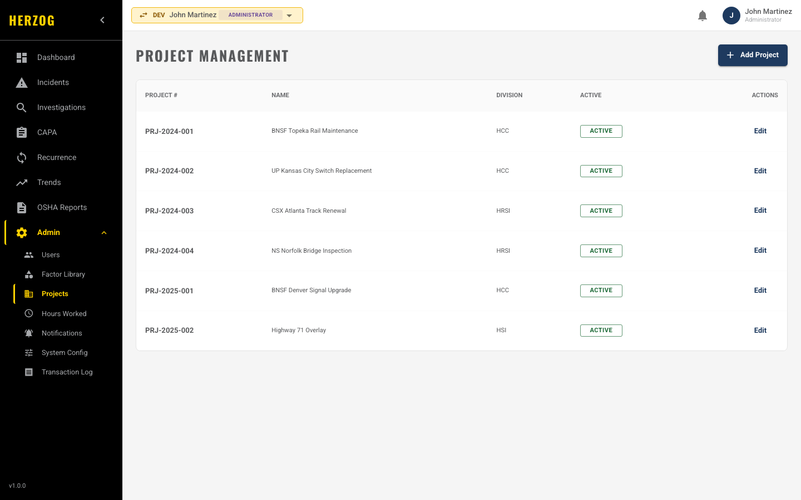

Manage projects for Project Manager role scoping:
- Add projects with a unique project number, name, and division
- Edit or deactivate projects
- Project Managers only see incidents/CAPAs for their assigned projects

### Hours Worked

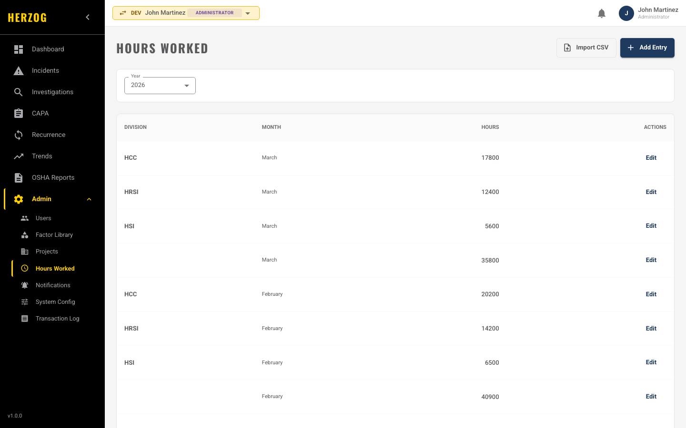

Enter monthly hours worked by division for TRIR and DART rate calculations:
- Select a year to view/edit entries
- Add entries by division, month, and hours
- CSV Import button for bulk data entry (placeholder)

This data is critical for accurate rate calculations. Without hours worked data, TRIR and DART rates will show as zero.

### Notification Settings

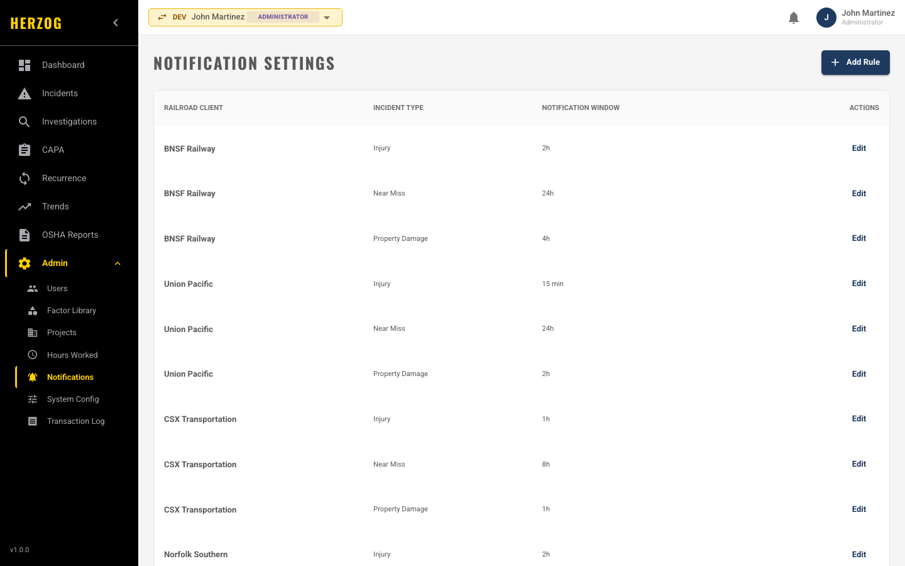

Configure railroad client notification windows:
- Set the required notification timeframe (in minutes) for each railroad client and incident type
- Example: BNSF requires injury notification within 120 minutes (2 hours)
- The system monitors these deadlines and sends alerts as they approach

### System Configuration

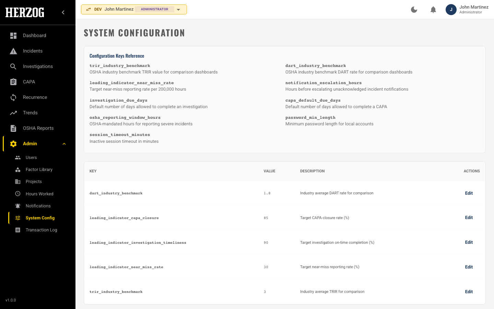

Configure system-wide settings stored as key-value pairs:
- **trir_industry_benchmark** -- industry average TRIR shown on the dashboard chart
- **dart_industry_benchmark** -- industry average DART rate
- **leading_indicator_near_miss_rate** -- target near-miss reporting rate (%)
- **leading_indicator_capa_closure** -- target CAPA closure rate (%)
- **leading_indicator_investigation_timeliness** -- target investigation on-time rate (%)

### Transaction Log

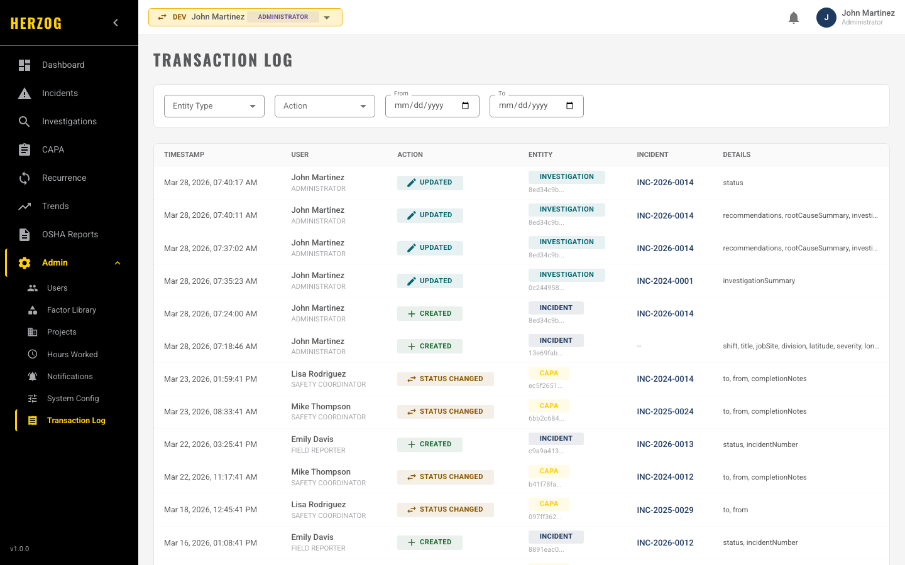

A comprehensive audit trail of all system activity:

**Filters:**
- **Entity Type** -- Incident, Investigation, Capa, User, Config, etc.
- **Action** -- Created, Updated, Status Changed, Deleted
- **Date Range** -- from/to date pickers

**Columns:**
- Timestamp
- User (name and role)
- Action (color-coded chip)
- Entity Type (color-coded chip)
- Linked Incident (clickable)
- Details (hover to see full change JSON)

All entries are immutable -- they cannot be edited or deleted.

---

## 10. User Roles & Permissions

The system supports seven user roles, each with different levels of access:

| Role | Dashboard | Incidents | Investigations | CAPA | Recurrence | Trends | Reports | Admin |
|------|-----------|-----------|----------------|------|------------|--------|---------|-------|
| Field Reporter | View | Create & View Own | -- | -- | -- | -- | -- | -- |
| Safety Coordinator | View | Full Access | Full Access | Full Access | -- | -- | View | -- |
| Safety Manager | View | Full Access | Full Access + Review | Full Access | View | View | View | -- |
| Project Manager | Project Only | Project Only | -- | -- | -- | -- | -- | -- |
| Division Manager | Division Only | Division Only | Division Only | Division Only | -- | View | -- | -- |
| Executive | View All | View All | View All | View All | View All | View All | View All | -- |
| Administrator | View All | Full Access | Full Access | Full Access | View All | View All | View All | Full Access |

**Key distinctions:**
- **Field Reporters** can only create incidents and view their own reports
- **Safety Coordinators** manage the full incident/investigation/CAPA workflow
- **Safety Managers** have the additional ability to review and approve investigations
- **Project Managers** only see data for their assigned projects
- **Division Managers** only see data for their division
- **Executives** have read-only access to everything
- **Administrators** have full access including user management and system configuration

---

## 11. Offline Mode

The application is a Progressive Web App (PWA) that works offline:

### How It Works
- When you lose internet connection, a yellow **"You are offline"** banner appears at the top of the screen
- You can continue to create and edit incidents while offline
- Changes are queued locally in your browser's storage
- A **sync indicator** in the top bar shows the number of pending changes

### When You Reconnect
- The sync engine automatically replays queued changes to the server
- If a change fails, it retries up to 5 times
- The sync indicator clears when all changes are processed

### Installing as an App
On mobile devices, you can install the application as a standalone app:
1. Open the app in Chrome/Safari
2. Tap "Add to Home Screen" from the browser menu
3. The app will appear as an icon on your device

---

## Support

For technical issues or feature requests, contact your system administrator or submit a ticket through the organization's IT support channel.

---

*Herzog Incident Investigation & Corrective Action System v1.0*
*User Manual generated March 2026*
